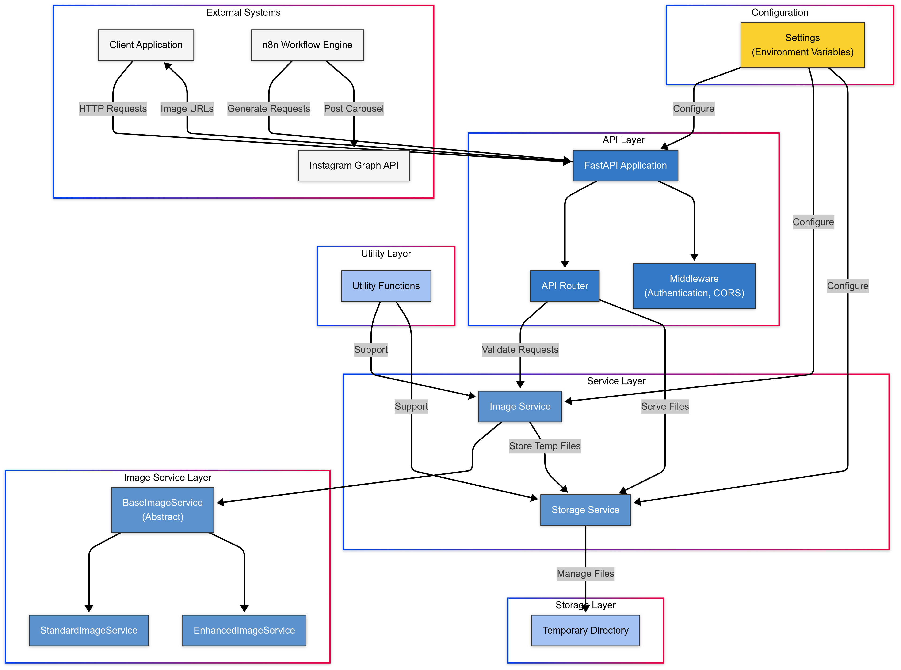
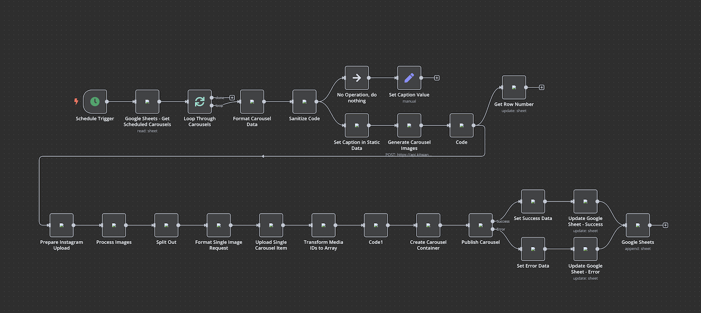

# Instagram Carousel Generator

A robust API for generating Instagram carousel images with consistent styling, packaged as a reusable software blueprint.


## Overview

The Instagram Carousel Generator is a professional-grade FastAPI application that automates the creation of visually consistent Instagram carousel posts. It transforms text content into beautifully formatted slide images, ready for publishing to Instagram via automation workflows.

**Key Features:**

- Generate carousel images with consistent dark-themed styling
- Text processing with gradient effects and proper wrapping
- Multi-slide carousel support with navigation indicators
- Optional logo inclusion on slides
- Robust error handling with fallbacks for rendering issues
- Comprehensive API for integration with automation tools like n8n
- Modular, extensible architecture designed for customization

## Architecture

The project follows a modular, service-oriented architecture designed for extensibility and maintainability:

```
instagram_carousel_generator/
├── api/                # API endpoints and routing
├── core/               # Core configuration
├── models/             # Data models and schemas
├── services/           # Business logic
│   └── image_service/  # Image generation services
├── utils/              # Utility functions
└── static/             # Static assets and temporary files
```

### Component Architecture



### Key Components

**1. API Layer**
- REST endpoints for carousel generation
- Request/response validation
- Error handling middleware

**2. Service Layer**
- Image Service: Core image generation with text rendering
- Storage Service: Temporary file management

**3. Core Layer**
- Configuration management with environment variable support
- Application settings and defaults

**4. Models Layer**
- Pydantic models for request/response validation
- Type definitions for service interfaces

### Documentation

For detailed documentation, please refer to the following:

- [Architecture Diagram](docs/images/architecture-diagram.png)
- [Workflow Diagram](docs/images/workflow-diagram.png)
- [Class Diagram](docs/images/class-diagram.png)
- [API Documentation](docs/api/endpoints.md)
- [Configuration Guide](docs/guides/configuration.md)
- [Deployment Guide](docs/guides/deployment.md)
- [n8n Workflow Implementation](docs/guides/n8n-workflow.md)
- [Contributing Guidelines](docs/guides/contributing.md)

## Installation

### Quick Start with Docker (Recommended)

The easiest way to get started is with Docker, which provides a complete development environment:

```bash
# Clone the repository
git clone https://github.com/kakil/instagram-carousel-api.git
cd instagram-carousel-api

# Set up the Docker environment
chmod +x scripts/setup-docker-env.sh
./scripts/setup-docker-env.sh

# Start the development environment
./scripts/docker.sh dev
```

The API will be available at http://localhost:5001 with hot-reloading enabled.

For more details, see the [Docker Development Environment](#docker-development-environment) section below.

### Manual Installation

If you prefer not to use Docker, you can set up the environment manually:

```bash
# Clone the repository
git clone https://github.com/kakil/instagram-carousel-api.git
cd instagram-carousel-api

# Create and activate virtual environment
python -m venv venv
source venv/bin/activate  # On Windows: venv\Scripts\activate

# Install dependencies
pip install -e .

# For development:
pip install -e ".[dev]"

# Copy example environment file
cp .env.example .env

# Run the application
uvicorn app.main:create_app --factory --reload
```

## Usage

### Using the API

#### Generate a Carousel

```bash
curl -X POST "http://localhost:5001/api/v1/generate-carousel" \
  -H "Content-Type: application/json" \
  -d '{
    "carousel_title": "5 Productivity Tips",
    "slides": [
      {"text": "Wake up early and plan your day"},
      {"text": "Use the Pomodoro technique for focus"},
      {"text": "Take regular breaks to recharge"}
    ],
    "include_logo": true,
    "logo_path": "static/assets/logo.png"
  }'
```

#### Generate a Carousel with Public URLs

```bash
curl -X POST "http://localhost:5001/api/v1/generate-carousel-with-urls" \
  -H "Content-Type: application/json" \
  -d '{
    "carousel_title": "5 Productivity Tips",
    "slides": [
      {"text": "Wake up early and plan your day"},
      {"text": "Use the Pomodoro technique for focus"},
      {"text": "Take regular breaks to recharge"}
    ]
  }'
```

### Image Service Python Interface

```python
from app.services.image_service import get_image_service, ImageServiceType

# Get the enhanced image service
service = get_image_service(ImageServiceType.ENHANCED.value, {
    'width': 1080,
    'height': 1080,
    'bg_color': (18, 18, 18)
})

# Generate carousel images
images = service.create_carousel_images(
    carousel_title="My Carousel",
    slides_data=[{"text": "Slide 1"}, {"text": "Slide 2"}],
    carousel_id="abc123",
    include_logo=True,
    logo_path="/path/to/logo.png"
)
```

## Integration with n8n

The Instagram Carousel Generator is designed to work seamlessly with [n8n](https://n8n.io/) for end-to-end Instagram posting automation:

1. Store carousel content in Google Sheets
2. Use n8n workflow to fetch content
3. Call API to generate carousel images
4. Post to Instagram via Graph API
5. Update status in Google Sheets



See the full implementation details in `docs/n8n-workflow-implementation.md`.

## Configuration

The application uses a comprehensive configuration system based on environment variables and `.env` files:

```bash
# Core settings
DEBUG=True
PUBLIC_BASE_URL="http://localhost:5001"

# Image settings
DEFAULT_WIDTH=1080
DEFAULT_HEIGHT=1080
DEFAULT_BG_COLOR_R=18
DEFAULT_BG_COLOR_G=18
DEFAULT_BG_COLOR_B=18
```

For complete configuration options, see `docs/configuration.md`.

## Development

### Project Setup

```bash
# Clone the repository
git clone https://github.com/kakil/instagram-carousel-api.git
cd instagram-carousel-api

# Set up development environment
python -m venv venv
source venv/bin/activate
pip install -e ".[dev]"

# Run tests
pytest
```

### Code Style

```bash
# Format code
black app tests

# Sort imports
isort app tests

# Check style
flake8 app tests
```

## Docker Development Environment

This project includes a comprehensive Docker-based development environment that makes it easy to develop, test, and deploy the application consistently across different platforms.

### Docker Commands

The `docker.sh` script provides several commands to make development easier:

| Command | Description |
|---------|-------------|
| `./scripts/docker.sh dev` | Start development environment |
| `./scripts/docker.sh dev:build` | Rebuild and start development environment |
| `./scripts/docker.sh test` | Run tests in Docker |
| `./scripts/docker.sh test:coverage` | Run tests with coverage report |
| `./scripts/docker.sh prod` | Start production environment |
| `./scripts/docker.sh prod:build` | Rebuild and start production environment |
| `./scripts/docker.sh clean` | Clean Docker resources |
| `./scripts/docker.sh logs` | Show logs |
| `./scripts/docker.sh shell` | Open a shell in the API container |
| `./scripts/docker.sh help` | Show help message |

### Docker Environments

The project includes multiple Docker Compose files for different environments:

- `docker-compose.yml`: Development environment with hot-reloading
- `docker-compose.advanced.yml`: Advanced development setup with Nginx, Redis, etc.
- `docker-compose.test.yml`: Test environment for running tests
- `docker-compose.prod.yml`: Production environment

For detailed information about Docker development, see the [Docker Production Deployment Guide](docs/guides/docker-production-deployment.md).

## Customization Guide

The Instagram Carousel Generator is designed to be customized and extended:

### Custom Image Service

```python
from app.services.image_service import BaseImageService

class CustomImageService(BaseImageService):
    """Custom implementation with unique styling"""

    def create_slide_image(self, title, text, slide_number, total_slides,
                           include_logo=False, logo_path=None):
        # Your custom implementation
        # ...
```

### Custom Font and Styling

1. Add custom fonts to `static/assets/`
2. Update `.env` configuration:
```
DEFAULT_FONT="YourFont.ttf"
DEFAULT_FONT_BOLD="YourFont-Bold.ttf"
DEFAULT_BG_COLOR_R=0
DEFAULT_BG_COLOR_G=0
DEFAULT_BG_COLOR_B=0
```

## Deployment

For detailed deployment instructions, see:
- [Production Deployment Guide](docs/guides/production-deployment.md)
- [Docker Production Deployment Guide](docs/guides/docker-production-deployment.md)
- [Cloudflare Integration Guide](docs/guides/cloudflare-integration.md)


### Production Setup

1. Configure environment variables for production:
```
DEBUG=False
PRODUCTION=True
PUBLIC_BASE_URL="https://your-domain.com"
API_KEY="your-secure-api-key"
ALLOW_ORIGINS="https://your-app-domain.com"
```

2. Set up Nginx configuration:
```nginx
server {
    listen 80;
    server_name api.yourdomain.com;

    location / {
        proxy_pass http://localhost:5001;
        proxy_set_header Host $host;
        proxy_set_header X-Real-IP $remote_addr;
    }
}
```

3. Set up systemd service:
```ini
[Unit]
Description=Instagram Carousel Generator API
After=network.target

[Service]
User=yourusername
WorkingDirectory=/path/to/instagram-carousel-api
ExecStart=/path/to/venv/bin/uvicorn app.main:create_app --factory --host 0.0.0.0 --port 5001
Restart=always

[Install]
WantedBy=multi-user.target
```

### Docker Deployment

```bash
# Build the image
docker build -t instagram-carousel-generator .

# Run with environment variables
docker run -p 5001:5001 \
  -e PUBLIC_BASE_URL=https://your-domain.com \
  -e API_KEY=your-secure-api-key \
  instagram-carousel-generator
```

For detailed Docker production deployment instructions, refer to the [Docker Production Deployment Guide](docs/guides/docker-production-deployment.md).

## License

This project is licensed under the MIT License - see the LICENSE file for details.

## Support

For questions, issues, or feature requests, please open an issue on GitHub or contact the maintainer directly.
